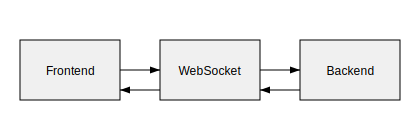

# Multicode

Перед началом работы обязательно ознакомьтесь с [RULES.md](RULES.md).
Инструкции для работы с искусственным ассистентом Codex, предназначенные только для людей, находятся в [docs/assistant_manual.md](docs/assistant_manual.md).


## Обзор
Multicode V3 — редактор исходного кода, который объединяет текстовое и визуальное представления программ. Пользователь может свободно переключаться между режимами и работать с дополнительными метаданными без изменения логики кода.

## Архитектура


- **Backend (Rust, Tauri):** парсинг файлов через tree-sitter, хранение и обработка метаданных, управление плагинами.
- **Frontend (Vite, JavaScript):** интерфейс с Monaco‑редактором и canvas‑основанным редактором блоков.
- **Локальный WebSocket‑сервер:** синхронизирует состояния между частями приложения.

## Windows prerequisites

Для сборки на Windows через окружение MSYS2 установите следующие пакеты:

- `gtk3`
- `pkg-config`
- `glib2`
- `cairo`
- `pango`

Используйте следующую команду установки в терминале MSYS2:

```bash
pacman -S --noconfirm mingw-w64-x86_64-gtk3 pkg-config
```

Убедитесь, что путь `MSYS2\\mingw64\\bin` добавлен в переменную окружения `PATH`, чтобы инструменты `pkg-config` и библиотеки были доступны в командной строке.

## Быстрый старт

Проект поставляется с набором npm‑скриптов для автоматической установки зависимостей и сборки.

Перед запуском этих скриптов установите базовые корневые зависимости:

```bash
npm install      # устанавливает базовые зависимости (fs-extra, ora), требуемые служебными скриптами
npm run setup    # проверяет и устанавливает недостающие зависимости во всех workspaces
npm run dev      # запускает среду разработки
npm run build    # собирает приложение
npm run test     # запускает тесты
npm run clean    # очищает артефакты и логи
npm run check:scripts # проверяет, что сценарии актуальны
```

Скрипт `npm run setup` выполняется после установки корневых модулей и занимается только рабочими пространствами: он читает поле `workspaces` из корневого `package.json` и устанавливает модули каждого пакета отдельно.

## Поддержка установочных скриптов

При добавлении новых зависимостей в любой workspace обязательно обновляйте `scripts/setup.js` и связанные скрипты установки (`scripts/dev.js`, `scripts/test.js` и др.). Это гарантирует, что `npm run setup` корректно установит все пакеты. Для проверки актуальности служебных скриптов используйте `npm run check:scripts`, который сравнивает последние изменения `package.json` с датами правок файлов в каталоге `scripts/`.

### Проверка перед коммитом

1. Выполните `npm run check:scripts` и убедитесь, что вывод не содержит предупреждений.
2. Запустите `npm run setup` в корне проекта и убедитесь, что в выводе нет сообщений о пропущенных зависимостях.
3. Выполните `npm test` или другие проверки сборки, чтобы подтвердить, что проект работает с добавленными пакетами.


## Стандартные проверки

Перед отправкой изменений убедитесь, что основные проверки завершаются без ошибок:

- `npm run lint` — статический анализ и проверка стиля JavaScript/TypeScript‑кода во `frontend/`;
- `npm test` — запуск юнит‑тестов фронтенда;
- `npm audit` — аудит зависимостей JavaScript/TypeScript;
- `cargo fmt -- --check` — проверка форматирования исходников Rust;
- `cargo clippy` — статический анализ backend'а;
- `cargo test` — юнит‑тесты backend'а;
- `cargo audit` — проверка зависимостей Rust;
- `npm run check:scripts` — контроль актуальности служебных скриптов.


## Ключевые возможности
- Переключение между текстовым и визуальным режимами.
- Сохранение метаданных в комментариях к исходному коду.
- Поддержка плагинов для расширения набора блоков.
- Работа с несколькими языками программирования:
  - Rust
  - Python
  - JavaScript
  - TypeScript
  - CSS
  - HTML
  - Go
  *(см. [backend/src/parser/mod.rs](backend/src/parser/mod.rs))*

## Структура метакомментариев
Служебная информация сохраняется в комментариях `@VISUAL_META` в формате JSON. Актуальное определение описано в [backend/meta.schema.json](backend/meta.schema.json).

Доступные поля:
- `id` (`string`, обязательное) — идентификатор, связывающий метаданные с блоком.
- `version` (`integer`, по умолчанию 1) — версия схемы метаданных.
- `x` (`number`, обязательное) — координата X на холсте.
- `y` (`number`, обязательное) — координата Y на холсте.
- `tags` (`string[]`) — произвольные теги, связанные с блоком.
- `links` (`string[]`) — ссылки на другие блоки по `id`.
- `extends` (`string`) — идентификатор записи, из которой наследуются данные.
- `origin` (`string`) — обратный путь до исходного внешнего файла.
- `translations` (`object`) — переводы подписей блока по коду языка.
- `ai` (`object`) — заметка, сгенерированная ИИ:
  - `description` (`string`) — описание от ИИ.
  - `hints` (`string[]`) — полезные подсказки.
- `extras` (`object`) — произвольные данные плагинов.
- `updated_at` (`string`, формат `date-time`, обязательное) — время последнего обновления в UTC.

Пример:
```json
{
  "id": "child",
  "version": 1,
  "x": 42,
  "y": 13,
  "tags": ["math", "demo"],
  "links": ["parent"],
  "extends": "parent",
  "origin": "path/to/original",
  "translations": { "en": "Child block", "ru": "Дочерний блок" },
  "ai": {
    "description": "Automatically summarized",
    "hints": ["Consider refactoring"]
  },
  "extras": { "plugin": "value" },
  "updated_at": "2024-01-01T00:00:00Z"
}
```

Примеры использования метакомментариев в исходном коде:

```rust
// @VISUAL_META {"id": "node", "x": 0, "y": 0}
```

```javascript
// @VISUAL_META {"id": "node", "x": 0, "y": 0}
```

```typescript
// @VISUAL_META {"id": "node", "x": 0, "y": 0}
```

```go
// @VISUAL_META {"id": "node", "x": 0, "y": 0}
```

```python
# @VISUAL_META {"id": "node", "x": 0, "y": 0}
```

```css
/* @VISUAL_META {"id": "node", "x": 0, "y": 0} */
```

```html
<!-- @VISUAL_META {"id": "node", "x": 0, "y": 0} -->
```

Комментарий не влияет на выполнение программы и может быть удалён при экспорте.

## Локализация

Backend использует модуль [`backend/src/i18n/mod.rs`](backend/src/i18n/mod.rs) для хранения базовых переводов названий блоков.

### Добавление новой локали

1. Дополните функцию `i18n::lookup` новыми кодами языков и переведёнными строками.
2. Обновите поле `translations` в комментариях `@VISUAL_META`, добавив переводы на новый язык.
3. При необходимости локализуйте фронтенд, чтобы интерфейс поддерживал новую локаль.

#### Пример: французский

В `i18n::lookup`:

```rust
map.insert("fr".into(), "Fonction".into());
```

В `@VISUAL_META`:

```javascript
// @VISUAL_META {"id": "node", "translations": { "en": "Child block", "ru": "Дочерний блок", "fr": "Bloc enfant" }}
```

Также при необходимости добавьте французские строки в интерфейсе фронтенда.

## Установка окружения
Multicode собирается как приложение на **Tauri 2.0**: фронтенд работает на Node.js, бэкенд — на Rust, а Tauri связывает их в одно десктопное приложение.

### Установка `rustc` и `cargo` из системных пакетов
В дистрибутивах на основе Debian можно установить инструменты Rust из официальных репозиториев:

```bash
sudo apt update
sudo apt install rustc cargo
```

Этой системной версии Rust достаточно для разработки и сборки проекта.

### Windows
1. **Node.js** — выполняет фронтенд и инструменты сборки.
   ```powershell
   winget install OpenJS.NodeJS.LTS
   ```
   Проверка:
   ```powershell
   node -v
   ```
   *Если версия не выводится, перезапустите PowerShell или проверьте `PATH`.*

2. **Rust** — компилирует backend и плагины.
   ```powershell
   winget install Rustlang.Rustup
   ```
   Проверка:
   ```powershell
   rustc --version
   ```
   *Для сборки нужен [MSVC Build Tools](https://visualstudio.microsoft.com/visual-cpp-build-tools/).* 

3. **Tauri CLI** — управляет сборкой и запуском.
   ```powershell
   npm install -g @tauri-apps/cli@^2
   ```
   Проверка:
   ```powershell
   tauri --version
   ```
   Документация: [Tauri prerequisites](https://v2.tauri.app/start/prerequisites/#windows).

4. **GTK/GLib** — графические библиотеки для Tauri.
   Установите [MSYS2](https://www.msys2.org/) и выполните в консоли MSYS2:
   ```bash
   pacman -S --noconfirm mingw-w64-x86_64-gtk3 pkg-config
   ```
   Затем в PowerShell:
   ```powershell
   $env:PKG_CONFIG_PATH="C:\msys64\mingw64\lib\pkgconfig"
   ```
   Проверка:
   ```powershell
   pkg-config --libs gtk+-3.0
   ```
   *Если `pkg-config` не видит библиотеки, проверьте переменную `PKG_CONFIG_PATH`.*

### macOS
1. **Node.js** — выполняет фронтенд и инструменты сборки.
   ```bash
   nvm install --lts
   ```
   Проверка: `node -v`
   *Если `nvm` не установлен, следуйте [инструкции](https://github.com/nvm-sh/nvm).* 

2. **Rust** — компилирует backend и плагины.
   ```bash
   curl https://sh.rustup.rs -sSf | sh
   ```
   Проверка: `rustc --version`

3. **Tauri CLI** — управляет сборкой и запуском.
   ```bash
   npm install -g @tauri-apps/cli@^2
   ```
   Проверка: `tauri --version`
   Документация: [Tauri prerequisites](https://v2.tauri.app/start/prerequisites/#macos).

4. **GTK/GLib** — требуются для GUI.
   ```bash
   brew install gtk+3 glib pkg-config
   export PKG_CONFIG_PATH="/opt/homebrew/lib/pkgconfig"
   ```
   Проверка: `pkg-config --libs gtk+-3.0`
   *Если `pkg-config` не найден, установите его через Homebrew.*

### Linux
1. **Node.js** — выполняет фронтенд и инструменты сборки.
   ```bash
   nvm install --lts
   ```
   Проверка: `node -v`

2. **Rust** — компилирует backend и плагины.
   В Debian/Ubuntu установите инструменты из официальных репозиториев:
   ```bash
   sudo apt update
   sudo apt install rustc cargo
   ```
   Проверка: `rustc --version`
   *Этой системной версии Rust достаточно для разработки и сборки проекта.*

3. **Tauri CLI** — управляет сборкой и запуском.
   ```bash
   npm install -g @tauri-apps/cli@^2
   ```
   Проверка: `tauri --version`
   Документация: [Tauri prerequisites](https://v2.tauri.app/start/prerequisites/#linux).

4. **GTK/GLib** — графические библиотеки для Tauri.
   ```bash
   sudo apt-get install -y libglib2.0-dev libgtk-3-dev pkg-config
   export PKG_CONFIG_PATH=/usr/lib/x86_64-linux-gnu/pkgconfig
   ```
   Проверка: `pkg-config --libs gtk+-3.0`
   *Если `pkg-config` не видит библиотеки, проверьте `PKG_CONFIG_PATH`.*

## Инструкции по запуску и сборке

### Подготовка проекта
1. **Клонируйте репозиторий**
   ```bash
   git clone https://github.com/<user>/Multicode_V3.git
   cd Multicode_V3
   ```
   Проверка: `git status`

2. **Установите зависимости фронтенда**
   ```bash
   cd frontend
   npm install
   npm test
   cd ..
   ```
   *Если тесты падают, попробуйте `npm ci`.*

3. **Соберите и проверьте бэкенд**
   ```bash
   cd backend
   cargo build
   cargo test
   cd ..
   ```
   *Ошибки `glib-2.0` или `pkg-config` означают, что не установлены GTK/GLib.*

### Запуск в режиме разработки
```bash
npm run dev
```
*Команда запускает бэкенд и фронтенд вместе и выводит адрес локального приложения.*

### Сборка релизной версии
```bash
npm run build
```
*Перед сборкой каталог `frontend/src-tauri/target` автоматически очищается.
Готовые бинарники появятся в `frontend/src-tauri/target/release`.*

### Быстрая проверка
```bash
npm test
cargo test
npm run dev -- examples/test.js
```
*Если тесты проходят и приложение запускается с примером, окружение настроено правильно.*

## Логирование
Бэкенд пишет журналы в каталог `logs/`, создавая ежедневные файлы `backend.log.<дата>` при каждом запуске (см. [backend/src/main.rs](backend/src/main.rs)).

Уровень подробности задаётся переменной окружения `RUST_LOG`. Например, чтобы включить отладочные сообщения:

```bash
RUST_LOG=debug cargo run
```

Очистить накопившиеся логи можно командой:

```bash
rm -rf logs/*
```

Для полного отключения логирования установите переменную:

```bash
RUST_LOG=off cargo run
```

## Использование CLI
Бэкенд содержит интерфейс командной строки для работы с кодом и метаданными. Подробную помощь по всем командам можно получить командой:

```
cargo run -- --help
```

### Команды

#### `parse`
Разбирает исходный файл и выводит информацию о блоках в формате JSON.

Параметры:
- `path` — путь к исходному файлу.
- `--lang <LANG>` — язык исходного файла.

#### `export`
Экспортирует файл, при необходимости удаляя метакомментарии `@VISUAL_META`.

Параметры:
- `input` — путь к исходному файлу.
- `output` — путь для сохранённого результата.
- `--strip-meta` — флаг удаления метакомментариев.

#### `meta list`
Показывает все метакомментарии из файла в формате JSON.

Параметры:
- `path` — путь к исходному файлу.

#### `meta fix`
Исправляет проблемы в метаданных, например дубликаты идентификаторов.

Параметры:
- `path` — путь к исходному файлу.

#### `meta remove`
Удаляет все метакомментарии из файла.

Параметры:
- `path` — путь к исходному файлу.

### Краткие примеры

| Команда | Описание | Пример |
| --- | --- | --- |
| `parse` | Парсит файл и выводит блоки | `cargo run -- parse path/to/file.rs --lang rust` |
| `export` | Экспортирует файл (при `--strip-meta` удаляет мету) | `cargo run -- export input.rs output.rs --strip-meta` |
| `meta list` | Показывает метакомментарии | `cargo run -- meta list path/to/file.rs` |
| `meta fix` | Исправляет метаданные | `cargo run -- meta fix path/to/file.rs` |
| `meta remove` | Удаляет метакомментарии | `cargo run -- meta remove path/to/file.rs` |

## Добавление модулей
Плагины позволяют добавлять новые блоки и функциональность. Минимальный
пример расположен в [examples/plugins](examples/plugins) и имеет следующую
структуру:

```
examples/plugins/
├── my_plugin.rs     — backend-часть
├── my-block.js      — frontend-часть
└── README.md
```

### Пошаговое создание плагина
1. Скопируйте структуру каталога из примера или создайте аналогичный
   набор файлов.
2. **Backend:** реализуйте трейт [`Plugin`](backend/src/plugins/mod.rs).
   Интерфейс определяет три метода: `name()` — уникальное имя плагина,
   `version()` — целевая версия API и `blocks()` — список
   `BlockDescriptor` с описанием новых блоков.
3. Скомпилируйте серверную часть в WebAssembly и подключите её к
   приложению:
   ```bash
   rustup target add wasm32-unknown-unknown
   cargo build --target wasm32-unknown-unknown --release
   cp target/wasm32-unknown-unknown/release/<имя>.wasm ../../plugins/
   ```
   Backend загружает `.wasm` через `WasmPlugin` и оборачивает его в
   реализацию трейта `Plugin`.
4. **Frontend:** реализуйте модуль с функцией
   `register({ Block, registerBlock })`, объявите класс блока и вызовите
   `registerBlock`. Пример:
   ```javascript
   export function register({ Block, registerBlock }) {
     class MyBlock extends Block {}
     registerBlock('MyBlock', MyBlock);
   }
   ```
5. Передайте путь к модулю в `loadBlockPlugins`, например
   `loadBlockPlugins(['./my-block.js'])`. Клиент запрашивает список
   модулей у сервера и регистрирует блоки, получая метаданные через
   WebSocket.

#### Сборка примера
Рабочий пример находится в каталоге
[examples/plugins](examples/plugins). После создания `Cargo.toml` для
плагина выполните команды:
```bash
cd examples/plugins
rustup target add wasm32-unknown-unknown
cargo build --target wasm32-unknown-unknown --release
```
Полученный `.wasm` скопируйте в каталог `plugins/`, а файл `my-block.js`
подключите через `loadBlockPlugins`.

### Тестирование плагинов
- Запускайте `cargo test` в каталоге backend для проверки серверной части.
- Выполняйте `npm test` в каталоге frontend, чтобы убедиться в корректной
  работе визуальной компоненты.
- Для интеграционной проверки запускайте приложение командой
  `npm run dev` и убедитесь, что новый блок отображается без ошибок.

## Словарь
- **Блок:** визуальное представление участка кода.
- **Метакомментарий:** комментарий `@VISUAL_META` с координатами и прочими данными.
- **Плагин:** набор расширений для добавления новых блоков.
- **Метаданные:** служебная информация о блоках, хранящаяся в метакомментариях.
- **Текстовый режим:** редактирование исходного кода через Monaco‑редактор.
- **Визуальный режим:** работа с программой в виде блоков на canvas.
- **Backend:** серверная часть (Rust, Tauri), отвечающая за парсинг и обработку данных.
- **Frontend:** клиентская часть (Vite, JavaScript), реализующая интерфейс пользователя.
- **WebSocket‑сервер:** локальный сервер для синхронизации состояний между backend и frontend.
- **Tree‑sitter:** библиотека для синтаксического разбора кода.
- **Monaco‑редактор:** текстовый редактор, используемый в текстовом режиме.
- **Canvas‑редактор:** визуальная среда для работы с блоками.
- **WebAssembly (Wasm):** формат, в который компилируются плагины backend.
- **Tauri:** фреймворк для создания десктопных приложений на веб‑технологиях.
- **Vite:** инструмент сборки и разработки фронтенда.

## Структура репозитория
- `backend` — серверная часть на Rust.
- `frontend` — интерфейс и клиентская логика.
- `plugins` — встроенные плагины и механизм их загрузки.
- `examples` — примеры плагинов и использования.
- `logs` — временные файлы и журналы backend (файлы вида `backend.log.YYYY-MM-DD`).

## Лицензия
Проект распространяется по лицензии MIT. Полный текст приведён в файле [LICENSE](LICENSE).

## Ручное тестирование

Сценарии ручной проверки описаны в [NODE_EDITOR_MANUAL_TESTS.md](NODE_EDITOR_MANUAL_TESTS.md).

1. Выполните `npm run dev`.
2. После запуска приложения следуйте шагам из документа.

Например, чтобы открыть приложение с тестовым файлом `examples/test.js`:

```bash
npm run dev -- examples/test.js
```
