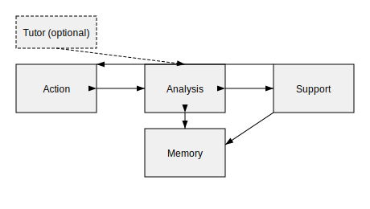

# Нейра — саморазвивающийся ИИ‑модуль для Multicode V3

## Навигация
- [Узлы действий](action-nodes.md)
- [Узлы анализа](analysis-nodes.md)
- [Узлы памяти](memory-nodes.md)
- [Архитектура анализа](analysis-architecture.md)
- [Поддерживающие системы](support-systems.md)
- [Личность Нейры](personality.md)
- [Шаблон узла](node-template.md)
- [Политика источников](source-policy.md)
- [Пример использования](usage-example.md)
- [Практическое руководство](practical-guide.md)
- [Глоссарий](glossary.md)
- [FAQ](faq.md)

## Оглавление
- [Назначение](#назначение)
- [Технические требования](#технические-требования)
- [Минимальная конфигурация (MVP)](#минимальная-конфигурация-mvp)
- [Ключевые компоненты](#ключевые-компоненты)
- [Поддерживающие системы](#поддерживающие-системы)
- [Планировщик и лимиты итераций](#планировщик-и-лимиты-итераций)
- [Эволюция и оптимизация](#эволюция-и-оптимизация)
- [Автономное создание подтипов и метаданные](#автономное-создание-подтипов-и-метаданные)
- [Эмоции, желания и этика](#эмоции-желания-и-этика)
- [Интеграция с Multicode](#интеграция-с-multicode)
- [План разработки](#план-разработки)
- [Использование](#использование)
- [Дополнительная документация](#дополнительная-документация)

## Назначение

**Нейра** — экспериментальный модуль искусственного интеллекта,
который дополняет редактор Multicode V3 возможностями самообучения,
планирования и интерактивного взаимодействия с пользователем.
Модуль строится как набор узлов (nodes), которые можно объединять,
оптимизировать и визуализировать в интерфейсе Multicode.

## Технические требования

- **CPU**: 4 ядра x86_64 или ARM, 2 ГГц+.
- **GPU**: необязательна; для обучения и больших моделей желателен CUDA‑совместимый ускоритель с 6 ГБ VRAM.
- **RAM**: минимум 8 ГБ (рекомендуется 16 ГБ).
- **Node.js**: версия 20 LTS или выше.
- **Rust**: версия 1.75 или выше.

Для расширения и ускорения вычислений можно использовать оборудование уровня [NVIDIA Data Center GPU](https://www.nvidia.com/en-us/data-center/).

## Личность Нейры

Стартовый образ и правила развития описаны в [отдельном документе](personality.md).
Кратко: на старте система проецирует образ 14‑летней девочки, увлекающейся анализом и играми.
По мере роста функциональности персонаж взрослеет до примерно 30 лет, но базовые черты сохраняются.
При необходимости доступен режим без личности для сухих академических ответов.

## Минимальная конфигурация (MVP)

Базовая версия Neira реализуется на Rust и включает:

1. **Коммуникационный узел (Chat Node)** – Telegram или Discord‑бот для диалога с разработчиком.
2. **Узел генерации кода (Code Node)** – создаёт и модифицирует исходный код.
3. **Узел саморазвития (Self-Improve Node)** – анализирует систему и предлагает патчи.
4. **Узлы анализа и памяти** – определяют действия и хранят знания.
5. **Интерфейс разработчика** – просмотр логов, подтверждение изменений, запуск обучения.
6. **Контролируемая среда обучения** – загрузка книг и локальных источников.
7. **Ядро личности** – правила и ценности, влияющие на ответы.

Для MVP выбираем локальную модель, переплавленную из открытых open-source решений.

## Ключевые компоненты



### 1. Узлы действий (Action Nodes)
Отвечают за конкретные операции: вывод текста,
запросы к API, генерацию кода, мониторинг состояния и т.д.

```rust
struct ActionNode {
    id: String,
    action_type: ActionType,
    connections: HashMap<String, f32>,
    execution_cache: LruCache<String, ExecutionResult>,
    metrics: ActionMetrics,
}
```

### 2. Узлы анализа (Analysis Nodes)
Обрабатывают запросы, строят логические цепочки,
оценивают достоверность данных и выбирают нужные действия. В базовом интерфейсе обязательны
поля `id`, `analysis_type`, `status`, `links`, `confidence_threshold` и `metadata.schema`. Цепочка рассуждений (`reasoning_chain`) формируется во время анализа и хранится в `AnalysisResult`.

```rust
struct AnalysisNode {
    id: String,
    analysis_type: AnalysisType,
    status: NodeStatus,
    links: Vec<String>,
    confidence_threshold: f32,
    metadata: AnalysisMetadata,
}

struct AnalysisMetadata {
    schema: String,
    // дополнительные метаданные
}
```

`status` фиксирует состояние узла (`draft`, `active`, `deprecated`, `error`) и
используется планировщиком и системами ревизий. Обязательное поле `links`
перечисляет связанные узлы и помогает планировщику ориентироваться в графе.
`confidence_threshold` задаёт минимальную допустимую `credibility` для принятия результата,
а `metadata.schema` содержит версию схемы описания узла. Последовательность рассуждений возвращается отдельно в `AnalysisResult`, что упрощает аудит и отладку.

При выполнении `analyze()` узел формирует `AnalysisResult` с метриками `quality_metrics`,
цепочкой `reasoning_chain`, вычисленным `uncertainty_score` и ссылками на использованные источники.

### 3. Узлы памяти (Memory Nodes)
Хранят знания и опыт, поддерживают приоритизацию источников
и ведут журнал ошибок.

```rust
struct MemoryNode {
    id: String,
    data_type: MemoryType,
    priority_level: Priority,
    source_reliability: SourceReliability,
    access_frequency: u32,
    last_accessed: DateTime<Utc>,
}
```

### 4. Личностные модули
Включают элементы, отвечающие за образ персонажа и игровые сценарии:
- **Диалоговая логика** — определяет намерение пользователя и выбирает стиль ответа.
- **Модуль личности** — хранит устойчивый образ Нейры и позволяет отключать его при необходимости.
- **Модуль интересов и игр** — обеспечивает обучение через участие в играх и формирование новых аналитических узлов.
- **Модуль скепсиса и проверки** — добавляет уточнения и проверку фактов.

### Взаимодействие с другими узлами

Узлы связываются через направленные рёбра данных и событий, формируя граф выполнения.


## Поддерживающие системы
- **Рабочая память и внимание** — отслеживает текущий контекст диалога,
  фокусируется на релевантных данных, очищает устаревшие записи.
- **Планирование и цели** — разбивает задачи на подцели,
  оценивает ресурсы и отслеживает прогресс.
- **Учёт неопределённости** — для каждого вывода вычисляется вероятность
  и объясняется источник сомнений.
- **Метапознание** — модуль самооценки анализирует собственные рассуждения
  и выбирает альтернативные стратегии.

Подробнее см. [поддерживающие системы](support-systems.md).

## Планировщик и лимиты итераций

`TaskScheduler` распределяет задачи по очередям `fast`, `standard` и `long`, учитывая параметры `priority`, `max_iterations` и `time_slice_ms`. Подробности см. в разделе [TaskScheduler](support-systems.md#taskscheduler).

Планировщик определяет порядок активации узлов и контролирует количество циклов обработки. Он поддерживает приоритеты, задержки и политики останова.

### Базовые параметры

Каждый узел может задавать:

- **priority** — значение от 0 до 10, чем выше, тем раньше выполняется узел;
- **max_iterations** — предел повторов, предотвращает бесконечные циклы;
- **time_slice_ms** — квант времени, после которого управление передаётся другому узлу.

```toml
[scheduler]
default_priority = 1
max_iterations = 32
time_slice_ms = 10
```

Параметры можно переопределять в пользовательском профиле или через UI.

### Тонкая настройка

Планировщик отслеживает фактическое время выполнения узлов и автоматически корректирует лимиты. Для долгих задач лимиты могут увеличиваться, для фоновых — снижаться. Пользователь может задать глобальный предел по времени или количеству итераций, после которого выполнение приостанавливается с уведомлением.

## Эволюция и оптимизация
Нейра отслеживает часто используемые цепочки узлов и создаёт «мосты» (BridgeNode)
для ускорения повторяющихся операций. Метрики успеха, производительности
и частоты использования формируют вес оптимизации. Возможна кодогенерация
новых узлов с последующим ручным подтверждением разработчика.

- Новые узлы запускаются параллельно со старыми.
- Пользователь тестирует устойчивость и функциональность.
- После одобрения новая версия становится основной, а прежняя архивируется или удаляется.

Связанные этапы описаны в [жизненном цикле узлов](../node-lifecycle.md).

## Автономное создание подтипов и метаданные

При обнаружении повторяющихся шаблонов взаимодействий система создаёт новые специализированные подтипы узлов. Процесс включает анализ метрик, генерацию исходного кода и описание метаданных.

```json
{
  "subtype": "analysis/semantic-filter",
  "version": 1,
  "author": "neira",
  "parameters": { "threshold": 0.7 },
  "connections": ["memory/long-term", "action/report"]
}
```

Метаданные хранятся в формате JSON и используются редактором для визуализации и проверки совместимости. Пользователь может разрешить автоматическое добавление подтипов или требовать ручного подтверждения.

## Эмоции, желания и этика
Имитация эмоций упрощает общение с пользователем. Настоящие эмоции
служат механизмами саморегуляции (лень, любопытство и т.д.). Система
гипер‑желаний позволяет задавать стратегические цели, на основе которых
формируются более конкретные задачи.

## Интеграция с Multicode
- Написан на Rust и работает рядом с основным backend'ом.
- Визуализация узлов и их связей доступна в интерфейсе Multicode
  через @VISUAL_META‑метаданные.
- Взаимодействует с frontend (Tauri + Vite + JavaScript)
  через существующий WebSocket‑слой.

## План разработки
1. **Базовые узлы и рабочая память** — создание Action/Analysis/Memory узлов
   и механизма контекста.
2. **Планирование и неопределённость** — внедрение PlanningSystem
   и UncertaintyQuantification.
3. **Метапознание и оптимизация** — запуск систем самооценки и мостов.
4. **Эмоции и желания** — добавление имитации эмоций, саморегуляции
   и гипер‑желаний.
5. **Визуализация и интеграция** — полноценное отображение узлов,
   трассировка и отладка внутри Multicode.

## Использование
Модуль запускается как часть backend Multicode V3.
Функциональность можно подключать поэтапно, позволяя разработчикам
добавлять узлы и адаптировать поведение системы под потребности
конкретного проекта.

Подробные инструкции по установке зависимостей,
запуску демонстрационной конфигурации и настройке
переменных окружения приведены в [deployment.md](deployment.md).

## Дополнительная документация
- [Узлы действий](action-nodes.md)
- [Узлы памяти](memory-nodes.md)
- [Узлы анализа](analysis-nodes.md)

---
Больше информации см. в [README проекта Multicode V3](../../README.md).

## Схемы

JSON‑схемы расположены в каталоге [../../schemas](../../schemas). При несовместимых изменениях повышайте версию: `1.0.0` → `1.1.0`.
