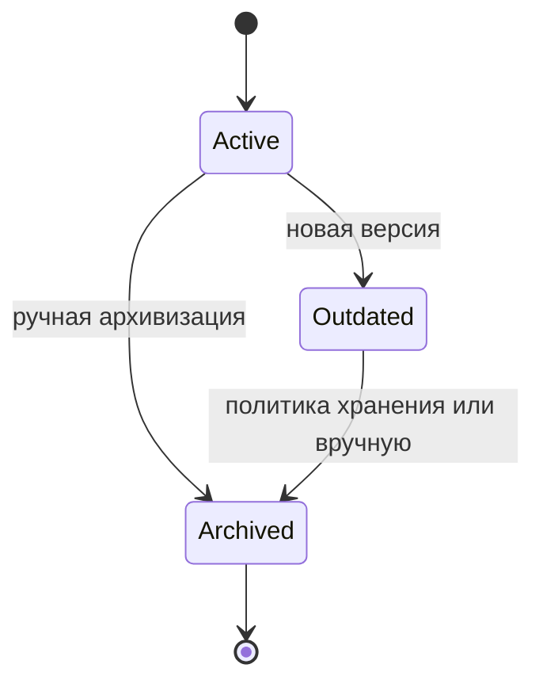

# Жизненный цикл версий узла

## Навигация
- [Обзор Нейры](neira/README.md)
- [Узлы действий](neira/action-nodes.md)
- [Узлы анализа](neira/analysis-nodes.md)
- [Узлы памяти](neira/memory-nodes.md)
- [Архитектура анализа](neira/analysis-architecture.md)
- [Поддерживающие системы](neira/support-systems.md)
- [Личность Нейры](neira/personality.md)
- [Шаблон узла](neira/node-template.md)
- [Политика источников](neira/source-policy.md)

## Оглавление
- [Состояния](#состояния)
- [Правила переходов](#правила-переходов)
- [Диаграмма состояний](#диаграмма-состояний)
- [Таблица `node_versions`](#таблица-node_versions)
  - [Пример записи](#пример-записи)
- [Примеры API](#примеры-api)
  - [Архивирование текущей версии](#архивирование-текущей-версии)
  - [Получение истории версий](#получение-истории-версий)

## Состояния
**Active** — текущая рабочая версия, доступна для изменений и использования.

**Outdated** — версия, вытесненная более новой, остаётся доступной только для просмотра и сравнения.

**Archived** — окончательно зафиксированная версия; только чтение, хранится для аудита и восстановлений.

- Переход из "Active" в "Outdated" выполняется только после тестирования и подтверждения пользователем.
- Со старой версией можно поступить по-разному: оставить её, архивировать или удалить при дублировании.

## Правила переходов
- Active → Outdated: автоматически при появлении новой версии того же узла.
- Outdated → Archived: по достижении заданного срока хранения или при ручной архивизации.
- Active → Archived: опционально при ручной архивизации без создания новой версии.

Из состояния Archived переходов нет; восстановление возможно только через создание новой Active версии на основе архивной.

## Диаграмма состояний


## Таблица `node_versions`
| Поле            | Описание                                                                |
|-----------------|-------------------------------------------------------------------------|
| `node_id`       | идентификатор узла                                                      |
| `version`       | номер версии                                                            |
| `state`         | состояние версии (`Active`, `Outdated`, `Archived`)                     |
| `created_at`    | время создания версии                                                   |
| `archived_at`   | время архивирования (если применимо)                                    |
| `prev_version_id` | ссылка на предыдущую версию                                           |
| `payload_hash`  | хэш содержимого для контроля целостности                                |

### Пример записи
```json
{
  "node_id": "node_0001",
  "version": 3,
  "state": "Archived",
  "created_at": "2024-05-10T12:00:00Z",
  "archived_at": "2024-06-01T09:30:00Z",
  "prev_version_id": 2,
  "payload_hash": "9f2b52c..."
}
```

## Примеры API
### Архивирование текущей версии
```
POST /api/nodes/node_0001/archive
{
  "reason": "manual"
}
```
Ответ:
```json
{
  "node_id": "node_0001",
  "version": 3,
  "state": "Archived"
}
```

### Получение истории версий
```
GET /api/nodes/node_0001/versions
```
Ответ:
```json
[
  { "version": 1, "state": "Archived" },
  { "version": 2, "state": "Outdated" },
  { "version": 3, "state": "Archived" }
]
```
