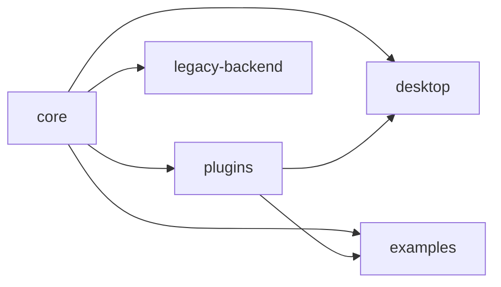

# Структура репозитория

## Каталоги

- `core/` — библиотека ядра. Дополнительные возможности подключаются через флаги: `git`, `watch`, `export`, `db`. Список модулей см. в [modules.md](modules.md).
- `desktop/` — оффлайн‑приложение на Iced. Подробности в [README-desktop.md](../README-desktop.md).
- `plugins/` — плагины блоков на JavaScript/TypeScript. Руководство и API: [plugin-guide.md](plugin-guide.md), [plugins.md](plugins.md).
- `examples/` — примеры использования, включая демонстрацию плагинов. Инструкции: [`examples/plugins/README.md`](../examples/plugins/README.md) и [event-bus-plugin-example.md](event-bus-plugin-example.md).
- `legacy-backend/` — опциональный архивный backend на Tauri.

## Схема зависимостей

Дополнительные материалы: [modules.md](modules.md), [plugin-guide.md](plugin-guide.md), [plugins.md](plugins.md), [glossary.md](glossary.md).

